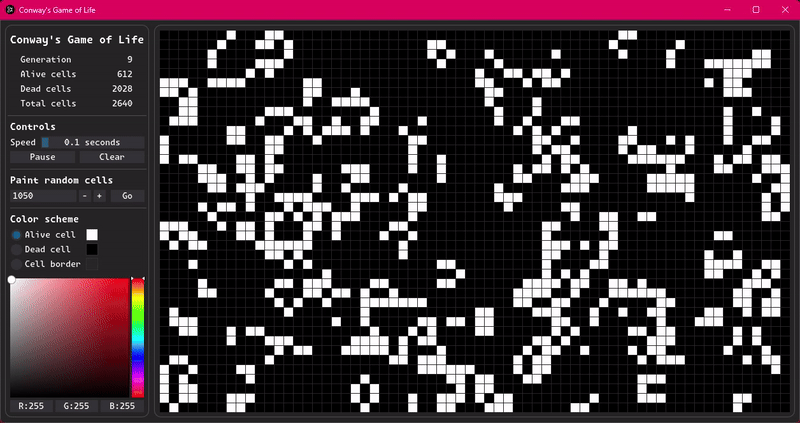
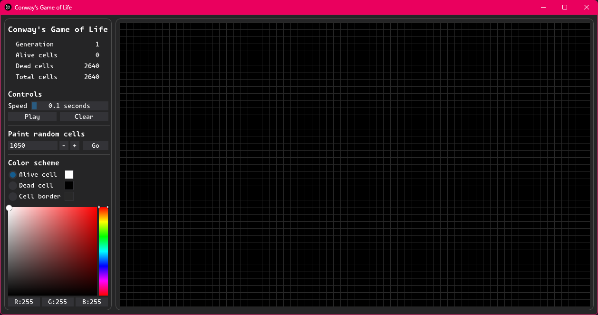
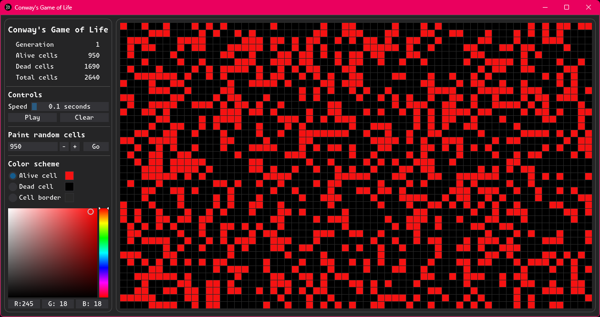
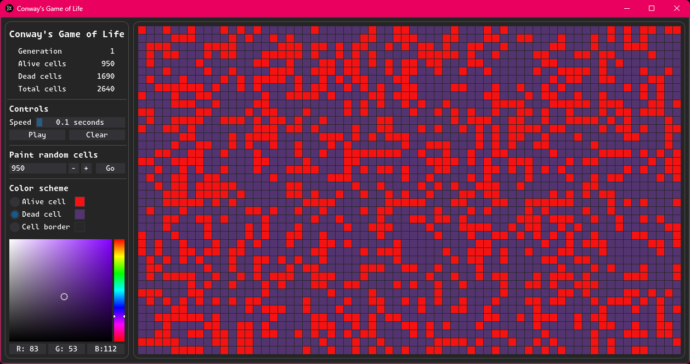
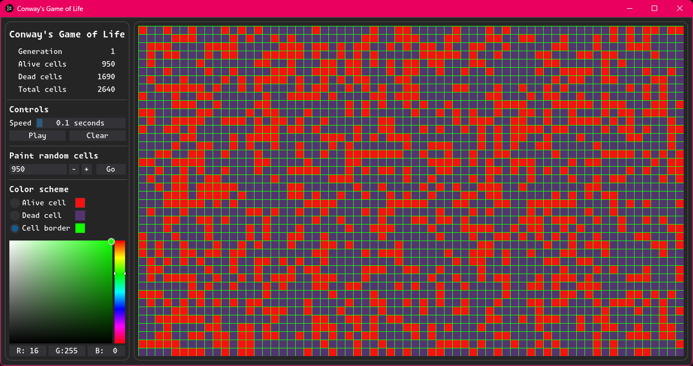

# Conway's Game of Life

Conway's Game of Life is a cellular automaton devised by the British mathematician John Horton Conway in 1970. It's a zero-player game, meaning that its evolution is determined by its initial state, requiring no further input.

## Table of Contents

1. [Introduction](#introduction)
2. [Features](#features)
3. [Installation](#installation)
4. [Usage](#usage)
5. [Screenshots](#screenshots)
6. [Technologies Used](#technologies-used)
7. [License](#license)

## Introduction

This project implements Conway's Game of Life using Python and the [Dear PyGui](https://github.com/hoffstadt/DearPyGui) library for the graphical interface. The Game of Life consists of a grid of cells that can live, die, or multiply based on a few mathematical rules. Despite its simplicity, it creates complex and beautiful patterns.

## Features

- Start, pause, and reset the game.
- Adjust the speed of the simulation.
- Paint random cells.
- Customize colors for alive cells, dead cells, and cell borders.
- Displays the current generation and cell counts.

## Installation

To run this project locally, follow these steps:

1. **Clone the repository**:
   ```bash
   git clone https://github.com/your-username/conways-game-of-life.git
   cd conways-game-of-life

2. **Install the required dependencies**: Make sure you have Python installed, then install the required packages using pip:
    ```bash
    pip install -r requirements.txt

## Usage
To start the application, run the following command:
```bash
python main.py
```

## Controls

- **Play/Pause**: Start or pause the simulation.
- **Clear**: Clear the grid and stop the simulation.
- **Speed Slider**: Adjust the speed of the simulation.
- **Random Cells**: Fill the grid with random alive cells.
- **Color Scheme**: Customize the colors of alive cells, dead cells, and cell borders.

## Screenshots







## Technologies Used

- **Python**: The main programming language.
- **Dear PyGui**: Used for the graphical user interface, providing an easy and efficient way to build complex GUIs with minimal code.
- **NumPy**: Used for efficient numerical operations and handling the grid state.

## License

This project is licensed under the MIT License - see the [LICENSE](./LICENSE) file for details.
